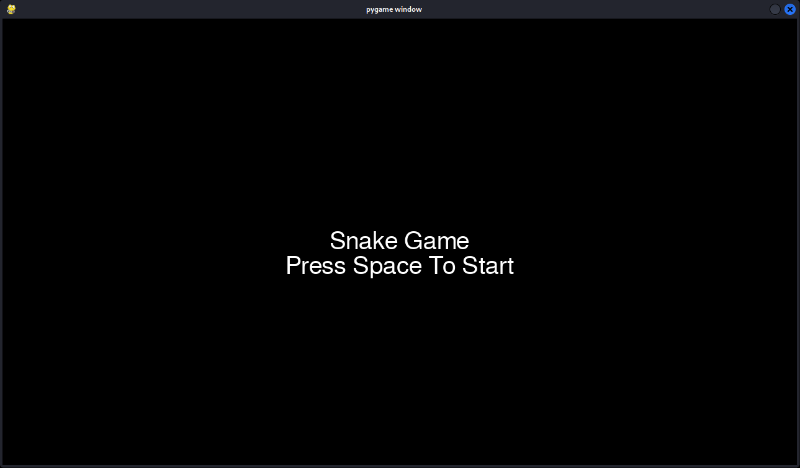
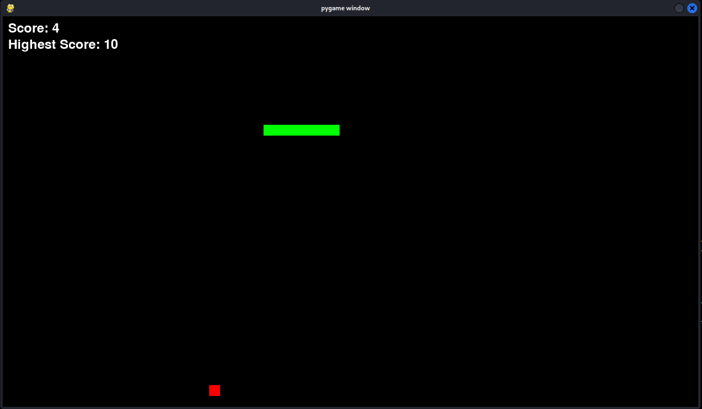

# 🐍 Snake Game - Pygame Edition

This is a classic **Snake Game** implemented in Python using the `pygame` library. The player controls a snake to eat red food squares, growing longer with each meal. The game ends if the snake collides with itself.

---

## 🎮 Features

* 🟩 Snake movement with arrow keys
* 🍎 Randomly placed food items
* 🎯 Score tracking and high score saving
* 🖥️ Start menu and game over screen
* 🔄 Restart and quit options
* 🔁 Snake wraps around the screen edges

---

## 🛠️ Requirements

* Python 3.x
* `pygame==2.6.1` library

Install pygame via pip:

```bash
pip install pygame
```

---

## ▶️ How to Play

1. Run the game:

   ```bash
   python snake_game.py
   ```

2. On the start menu, press **Spacebar** to begin.

3. Use the arrow keys to control the snake:

   * ⬅️ Left Arrow: Move left
   * ➡️ Right Arrow: Move right
   * ⬆️ Up Arrow: Move up
   * ⬇️ Down Arrow: Move down

4. Eat red food to grow and increase your score.

5. Don’t run into yourself — that ends the game

6. On the Game Over screen:

   * Press **R** to restart
   * Press **Q** to quit

---

## 💾 High Score Saving

* Your highest score is automatically saved in a file named `highest_score.txt`.
* If the file is missing or empty, it starts from 0.

---

## 📸 Screenshots
Start Menu Screen


Gameplay Screen


Game Over Screen


---

## 📄 License

This project is licensed under the MIT License.